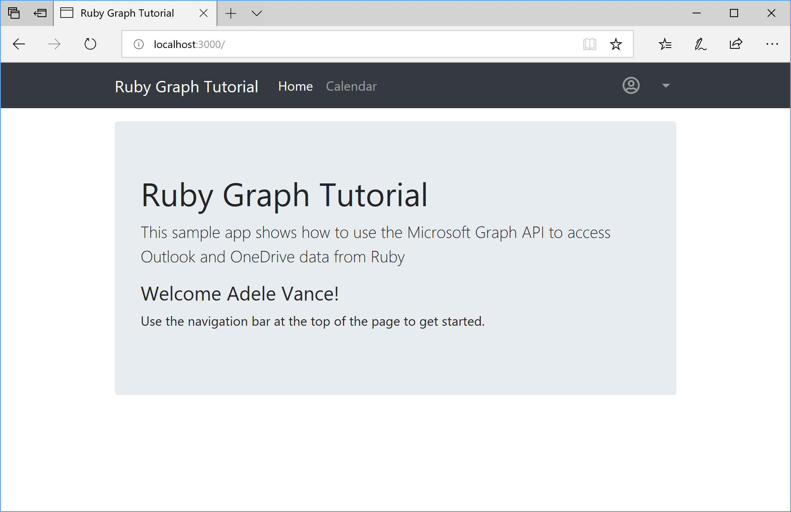
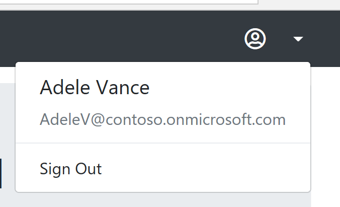

<!-- markdownlint-disable MD002 MD041 -->

В этом упражнении вы будете расширяем приложение из предыдущего упражнения для поддержки проверки подлинности с помощью Azure AD. Это необходимо для получения необходимого маркера доступа OAuth для вызова Microsoft Graph. На этом этапе вы интегрируете драгоценный камень [omniauth – OAuth2](https://github.com/omniauth/omniauth-oauth2) в приложение и создаете особую стратегию omniauth.

Сначала создайте отдельный файл для хранения идентификатора и секрета приложения. Создайте `oauth_environment_variables.rb` в `./config` папке новый файл и добавьте приведенный ниже код.

```ruby
ENV['AZURE_APP_ID'] = 'YOUR_APP_ID_HERE'
ENV['AZURE_APP_SECRET'] = 'YOUR_APP_SECRET_HERE'
ENV['AZURE_SCOPES'] = 'openid profile email offline_access user.read calendars.read'
```

Замените `YOUR_APP_ID_HERE` идентификатором приложения на портале регистрации приложений и замените `YOUR_APP_SECRET_HERE` созданным паролем.

> [!IMPORTANT]
> Если вы используете систему управления версиями (например, Git), то в дальнейшем будет полезно исключить `oauth_environment_variables.rb` файл из системы управления версиями, чтобы избежать непреднамеренного утечки идентификатора и пароля приложения.

Теперь добавьте код для загрузки этого файла, если он присутствует. Откройте `./config/environment.rb` файл и добавьте приведенный ниже код перед `Rails.application.initialize!` строкой.

```ruby
# Load OAuth settings
oauth_environment_variables = File.join(Rails.root, 'config', 'oauth_environment_variables.rb')
load(oauth_environment_variables) if File.exist?(oauth_environment_variables)
```

## <a name="setup-omniauth"></a>Настройка OmniAuth

Вы уже установили `omniauth-oauth2` драгоценный камень, но чтобы он работал с конечными точками Azure OAuth, необходимо [создать стратегию OAuth2](https://github.com/omniauth/omniauth-oauth2#creating-an-oauth2-strategy). Это класс Ruby, определяющий параметры для создания запросов OAuth для поставщика Azure.

Создайте `microsoft_graph_auth.rb` в `./lib` папке новый файл и добавьте приведенный ниже код.

```ruby
require 'omniauth-oauth2'

module OmniAuth
  module Strategies
    # Implements an OmniAuth strategy to get a Microsoft Graph
    # compatible token from Azure AD
    class MicrosoftGraphAuth < OmniAuth::Strategies::OAuth2
      option :name, :microsoft_graph_auth

      DEFAULT_SCOPE = 'openid email profile User.Read'.freeze

      # Configure the Microsoft identity platform endpoints
      option  :client_options,
              site:          'https://login.microsoftonline.com',
              authorize_url: '/common/oauth2/v2.0/authorize',
              token_url:     '/common/oauth2/v2.0/token'

      # Send the scope parameter during authorize
      option :authorize_options, [:scope]

      # Unique ID for the user is the id field
      uid { raw_info['id'] }

      # Get additional information after token is retrieved
      extra do
        {
          'raw_info' => raw_info
        }
      end

      def raw_info
        # Get user profile information from the /me endpoint
        @raw_info ||= access_token.get('https://graph.microsoft.com/v1.0/me').parsed
      end

      def authorize_params
        super.tap do |params|
          params['scope'.to_sym] = request.params['scope'] if request.params['scope']
          params[:scope] ||= DEFAULT_SCOPE
        end
      end

      # Override callback URL
      # OmniAuth by default passes the entire URL of the callback, including
      # query parameters. Azure fails validation because that doesn't match the
      # registered callback.
      def callback_url
        options[:redirect_uri] || (full_host + script_name + callback_path)
      end
    end
  end
end
```

Уделите время, чтобы узнать, что делает этот код.

- Настройка конечных `client_options` точек платформы удостоверений (Майкрософт).
- Он указывает, что `scope` параметр должен быть отправлен на этапе авторизации.
- Он сопоставляет `id` свойство пользователя с уникальным идентификатором пользователя.
- Он использует маркер доступа для извлечения профиля пользователя из Microsoft Graph, чтобы заполнить `raw_info` хэш.
- Он переопределяет URL-адрес обратного вызова, чтобы убедиться, что он соответствует зарегистрированному ответному вызову на портале регистрации приложений.

Теперь, когда мы определили стратегию, необходимо настроить OmniAuth для ее использования. Создайте `omniauth_graph.rb` в `./config/initializers` папке новый файл и добавьте приведенный ниже код.

```ruby
require 'microsoft_graph_auth'

Rails.application.config.middleware.use OmniAuth::Builder do
  provider :microsoft_graph_auth,
           ENV['AZURE_APP_ID'],
           ENV['AZURE_APP_SECRET'],
           scope: ENV['AZURE_SCOPES']
end
```

Этот код будет выполняться при запуске приложения. Он загружает промежуточный по OmniAuth с `microsoft_graph_auth` поставщиком, настроенным с использованием переменных среды, `oauth_environment_variables.rb`заданных в.

## <a name="implement-sign-in"></a>Реализация входа

Теперь, когда настроено промежуточное по OmniAuth, вы можете перейти к добавлению входа в приложение. Выполните следующую команду в интерфейсе командной строки, чтобы создать контроллер для входа и выхода.

```Shell
rails generate controller Auth
```

Откройте файл `./app/controllers/auth_controller.rb`. Добавьте в `AuthController` класс метод обратного вызова. Этот метод будет вызываться по промежуточного слоя OmniAuth после завершения процесса OAuth.

```ruby
def callback
  # Access the authentication hash for omniauth
  data = request.env['omniauth.auth']

  # Temporary for testing!
  render json: data.to_json
end
```

Теперь все это позволяет отобразить хэш, предоставленный OmniAuth. Мы будем использовать эту проверку, чтобы убедиться, что наш вход работает перед переходом. Перед тестированием необходимо добавить маршруты в `./config/routes.rb`.

```ruby
# Add route for OmniAuth callback
match '/auth/:provider/callback', to: 'auth#callback', via: [:get, :post]
```

Теперь обновите представления, чтобы войти в систему. Открыть `./app/views/layouts/application.html.erb`. Замените строку на `<a href="#" class="nav-link">Sign In</a>` приведенную ниже строку.

```html
<%= link_to "Click here to sign in", "/auth/microsoft_graph_auth", method: :post, class: "nav-link" %>
```

Откройте `./app/views/home/index.html.erb` файл и замените `<a href="#" class="btn btn-primary btn-large">Click here to sign in</a>` строку приведенным ниже фрагментом.

```html
<%= link_to "Click here to sign in", "/auth/microsoft_graph_auth", method: :post, class: "btn btn-primary btn-large" %>
```

Запустите сервер и перейдите к `https://localhost:3000`. Нажмите кнопку входа, и вы будете перенаправлены на `https://login.microsoftonline.com`. Войдите с помощью учетной записи Майкрософт и согласия с запрошенными разрешениями. Браузер перенаправляется в приложение, отображая хэш, созданный с помощью OmniAuth.

```json
{
  "provider": "microsoft_graph_auth",
  "uid": "eb52b3b2-c4ac-4b4f-bacd-d5f7ece55df0",
  "info": {
    "name": null
  },
  "credentials": {
    "token": "eyJ0eXAi...",
    "refresh_token": "OAQABAAA...",
    "expires_at": 1529517383,
    "expires": true
  },
  "extra": {
    "raw_info": {
      "@odata.context": "https://graph.microsoft.com/v1.0/$metadata#users/$entity",
      "id": "eb52b3b2-c4ac-4b4f-bacd-d5f7ece55df0",
      "businessPhones": [
        "+1 425 555 0109"
      ],
      "displayName": "Adele Vance",
      "givenName": "Adele",
      "jobTitle": "Retail Manager",
      "mail": "AdeleV@contoso.onmicrosoft.com",
      "mobilePhone": null,
      "officeLocation": "18/2111",
      "preferredLanguage": "en-US",
      "surname": "Vance",
      "userPrincipalName": "AdeleV@contoso.onmicrosoft.com"
    }
  }
}
```

## <a name="storing-the-tokens"></a>Сохранение маркеров

Теперь, когда вы можете получить маркеры, следует реализовать способ их хранения в приложении. Так как это пример приложения, для простоты вы будете хранить их в сеансе. Реальное приложение использует более надежное решение для безопасного хранения, например базу данных.

Откройте файл `./app/controllers/application_controller.rb`. Вы добавите все методы управления маркерами здесь. Так как все остальные контроллеры наследуют `ApplicationController` класс, они смогут использовать эти методы для доступа к маркерам.

Добавьте приведенный ниже метод в класс `ApplicationController`. Метод принимает хэш OmniAuth в качестве параметра и извлекает релевантные биты информации, а затем сохраняет их в сеансе.

```ruby
def save_in_session(auth_hash)
  # Save the token info
  session[:graph_token_hash] = auth_hash.dig(:credentials)
  # Save the user's display name
  session[:user_name] = auth_hash.dig(:extra, :raw_info, :displayName)
  # Save the user's email address
  # Use the mail field first. If that's empty, fall back on
  # userPrincipalName
  session[:user_email] = auth_hash.dig(:extra, :raw_info, :mail) ||
                         auth_hash.dig(:extra, :raw_info, :userPrincipalName)
end
```

Теперь добавьте функции доступа для получения имени пользователя, адреса электронной почты и маркера доступа обратно из сеанса.

```ruby
def user_name
  session[:user_name]
end

def user_email
  session[:user_email]
end

def access_token
  session[:graph_token_hash][:token]
end
```

Наконец, добавьте код, который будет выполняться до обработки какого-либо действия.

```ruby
before_action :set_user

def set_user
  @user_name = user_name
  @user_email = user_email
end
```

Этот метод задает переменные, используемые макетом (в `application.html.erb`) для отображения сведений о пользователе в панели навигации. Добавив его сюда, вам не нужно добавлять этот код в каждое действие с одним контроллером. Однако это также будет выполняться для действий `AuthController`, которые не являются оптимальными. Добавьте следующий код в `AuthController` класс, `./app/controllers/auth_controller.rb` чтобы пропустить действие before.

```ruby
skip_before_action :set_user
```

Затем обновите `callback` функцию в `AuthController` классе для хранения маркеров в сеансе и перенаправление обратно на главную страницу. Замените имеющуюся функцию `callback` указанным ниже кодом.

```ruby
def callback
  # Access the authentication hash for omniauth
  data = request.env['omniauth.auth']

  # Save the data in the session
  save_in_session data

  redirect_to root_url
end
```

## <a name="implement-sign-out"></a>Реализация выхода

Перед тестированием новой функции добавьте способ выхода. Добавьте в `AuthController` класс следующее действие.

```ruby
def signout
  reset_session
  redirect_to root_url
end
```

Добавьте это действие в `./config/routes.rb`.

```ruby
get 'auth/signout'
```

Теперь обновите представление, чтобы использовать `signout` действие. Открыть `./app/views/layouts/application.html.erb`. Замените строку `<a href="#" class="dropdown-item">Sign Out</a>` следующим:

```html
<%= link_to "Sign Out", {:controller => :auth, :action => :signout}, :class => "dropdown-item" %>
```

Перезапустите сервер и пройдите процесс входа. Необходимо вернуться на домашнюю страницу, но пользовательский интерфейс должен измениться, чтобы показать, что вы вошли в систему.



Щелкните аватар пользователя в правом верхнем углу, чтобы получить доступ к ссылке **выхода** . При нажатии кнопки **выйти** сбрасывается сеанс и возвращается на домашнюю страницу.



## <a name="refreshing-tokens"></a>Обновление маркеров

Если вы близки к хэшу, созданному с помощью OmniAuth, обратите внимание на два маркера в хэш `token` - `refresh_token`коде: и. Значение в `token` — это маркер доступа, который отправляется в `Authorization` заголовке вызовов API. Это маркер, который позволяет приложению получать доступ к Microsoft Graph от имени пользователя.

Однако этот маркер кратковременно используется. Срок действия маркера истечет через час после его выдачи. В `refresh_token` этом случае значение становится полезным. Маркер обновления позволяет приложению запросить новый маркер доступа, не требуя от пользователя повторного входа. Обновите код управления маркером, чтобы реализовать обновление маркеров.

Откройте `./app/controllers/application_controller.rb` и добавьте следующие `require` операторы в верхней части:

```ruby
require 'microsoft_graph_auth'
require 'oauth2'
```

Затем добавьте указанный ниже метод в `ApplicationController` класс.

```ruby
def refresh_tokens(token_hash)
  oauth_strategy = OmniAuth::Strategies::MicrosoftGraphAuth.new(
    nil, ENV['AZURE_APP_ID'], ENV['AZURE_APP_SECRET']
  )

  token = OAuth2::AccessToken.new(
    oauth_strategy.client, token_hash[:token],
    refresh_token: token_hash[:refresh_token]
  )

  # Refresh the tokens
  new_tokens = token.refresh!.to_hash.slice(:access_token, :refresh_token, :expires_at)

  # Rename token key
  new_tokens[:token] = new_tokens.delete :access_token

  # Store the new hash
  session[:graph_token_hash] = new_tokens
end
```

Этот метод использует драгоценный камень [OAuth2](https://github.com/oauth-xx/oauth2) (зависимость от `omniauth-oauth2` драгоценного камень) для обновления маркеров и обновления сеанса.

Теперь поместите этот метод для использования. Для этого сделайте `access_token` метод доступа в `ApplicationController` классе более многоразрядным. Вместо того чтобы просто возвратить маркер из сеанса, он сначала проверяет, является ли срок его действия близким к сроку действия. Если это так, то оно обновится перед возвратом маркера. Замените текущий `access_token` метод на приведенный ниже.

```ruby
def access_token
  token_hash = session[:graph_token_hash]

  # Get the expiry time - 5 minutes
  expiry = Time.at(token_hash[:expires_at] - 300)

  if Time.now > expiry
    # Token expired, refresh
    new_hash = refresh_tokens token_hash
    new_hash[:token]
  else
    token_hash[:token]
  end
end
```
